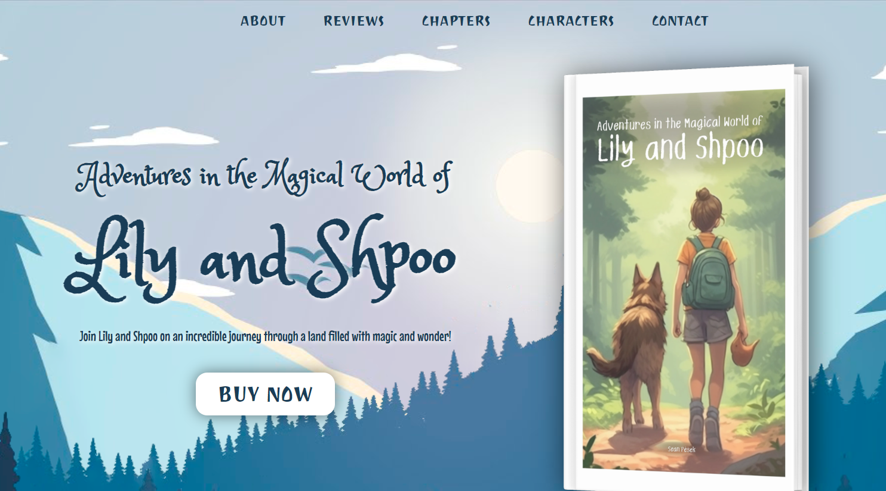

# Book Landing Page

This repository contains a book landing page designed to showcase and promote a book & ebook. The template provides a visually appealing and user-friendly layout to engage readers and generate interest in the book. Hero section contain smooth parallax scroll-animation.

## Demo

Check out the live demo of the Book Landing Page template [here](https://pawelslatwyezcky.github.io/book_landing/)!

## Features

- **Attractive Design:** The landing page template features a modern and eye-catching design to capture the attention of visitors.
- **Book Details:** Display key details about the book, such as the title, author, synopsis, and cover image.
- **Call-to-Action:** Encourage visitors to take action, such as purchasing the book or signing up for updates, using prominent call-to-action buttons.
- **Reader Reviews:** Showcase positive reviews or testimonials from readers to build credibility and interest.
- **Author Bio:** Include an author biography section to provide background information and establish authority.
- **Responsive and Mobile-Friendly:** The template is fully responsive and optimized for various screen sizes and devices.

## Screenshots

## Getting Started

To use the Book Landing Page template for your own book, follow these steps:

1. Clone the repository to your local machine using `git clone https://github.com/pawelslatwyezcky/book_landing.git`.
2. Customize the template with your book's details, cover image, author bio, and other relevant content.
3. Update the call-to-action buttons with appropriate links or actions for readers.
4. Deploy the modified template to your preferred hosting service or use GitHub Pages to host it.

## Technologies Used

- React

## Customization

The template is highly customizable, allowing you to tailor it to your book's specific needs. Feel free to modify the files to suit your requirements.

## Contributing

Contributions to this project are welcome! If you have any suggestions, improvements, or find any issues, please feel free to submit a pull request.
